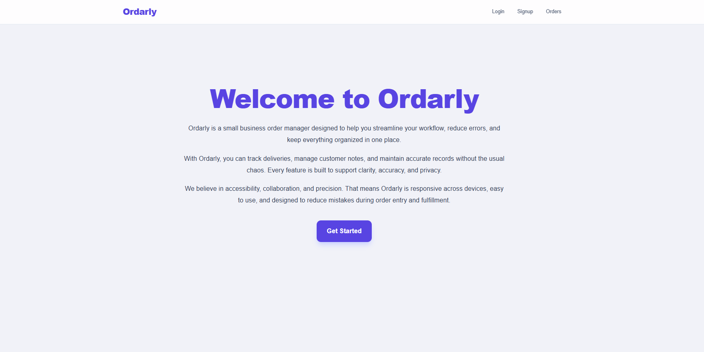

# Ordely

Internal web app for small food businesses to manage customer orders.

## Live Demo

https://orderly-amber.vercel.app/

## Team

- Raymond Mukonda
- Simond Mukonda

## Project Summary

Ordely is a small business order management platform designed to help food businesses manage customer orders, track order progress, and support staff/admin workflows from a clean and responsive dashboard.

The app includes secure authentication, role-based access, order creation and management, and a protected API documentation experience for testing and support.

## Features

- User signup and login
- Role-based access for staff and admin users
- Order list and detail views
- Create, update, and delete order flows
- Admin staff management view
- GitHub OAuth login support
- Protected API docs page
- Responsive dashboard and order UI
- Postgres database integration


## Site Image


## Tech Stack

- Next.js
- TypeScript
- Tailwind CSS
- PostgreSQL
- GitHub OAuth
- JWT-based session handling

## Design Direction

### Brand and Styling
- Primary: emerald-600
- Secondary: amber-500
- Neutral: gray-100 and gray-700
- Success: green-500
- Error: red-500

### Typography
- Headings: Inter
- Body: Roboto or Nunito

### Layout
- Fixed app shell with header and footer
- Consistent spacing using Tailwind multiples of 4
- Clean dashboard and staff order management structure

## Local Setup

```bash
npm install
npm run dev
```

Then open:

```text
http://localhost:3000
```

## Production Deployment

The app is deployed on Vercel:

https://orderly-amber.vercel.app/

## Notes

The project includes:
- backend API routes for auth and orders
- a protected Swagger docs page
- database connection setup using environment variables
- example seed data and admin/staff account setup

