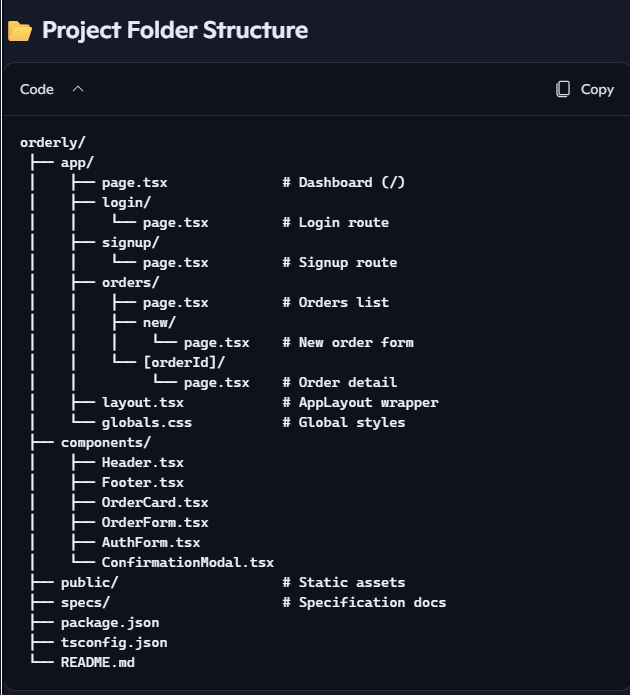
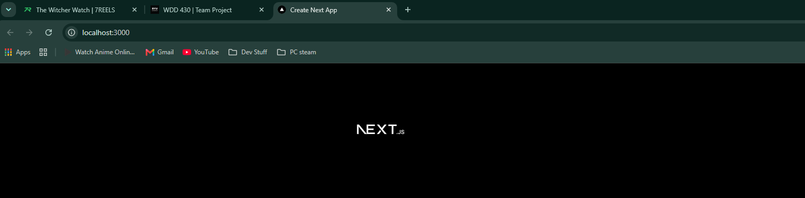

Internal web app for small food businesses to manage customer orders.

Orderly Live Site: https://orderly-odtacvnmx-raymondmukonda.vercel.app/ 

Team:
Raymond Mukonda
Jerson Jose Manuel Porras Rosales
Simond Mukonda

Week 03 Meeting:

Design Theme & Branding
Color Palette (Tailwind CSS)
Primary: emerald-600 → buttons, highlights

Secondary: amber-500 → accents, alerts

Neutral: gray-100, gray-700 → backgrounds, text

Success: green-500 → confirmed/prepared orders

Error: red-500 → validation errors, failed actions

Typography
Headings: Inter (bold, clean sans-serif)

Body: Roboto or Nunito (friendly, readable)

Imported via Google Fonts and applied with Tailwind’s font-sans.

Layout & Spacing
Global Layout: AppLayout with fixed Header + Footer, scrollable main content.

Spacing: Use Tailwind multiples of 4 (p-4, p-6, gap-4) consistently.

UI Library: Tailwind utility classes; optional shadcn/ui for modals, buttons, and accessibility.

